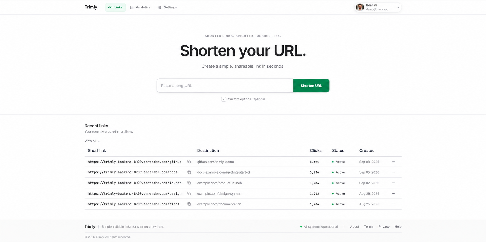
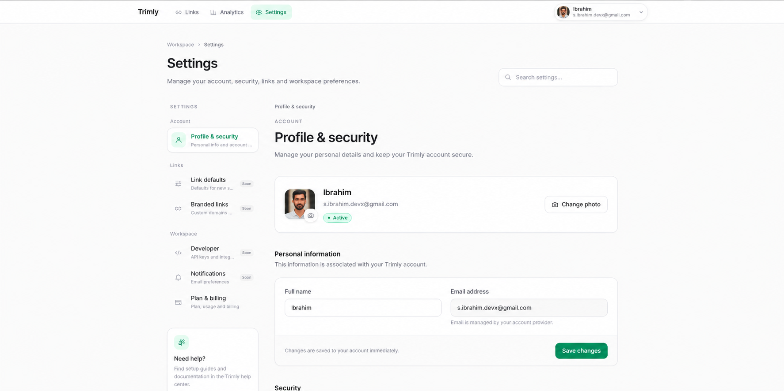

# Trimly

> A simple, production-oriented URL shortener built with Spring Boot.

**Live:** [Open Trimly](https://trimly.s-ibrahim-devx.workers.dev/)

Trimly turns long URLs into short, shareable links with custom aliases,
expiration, authentication, and click analytics.

The application is intentionally closed-source. This repository contains
the public product and engineering documentation.

---

## Product Preview

### Link Management

<p align="center">
  
</p>

Create and manage short links from a focused workspace.

### Analytics

<p align="center">
  
</p>

Track clicks and understand link performance over time.

### Account & Security

<p align="center">
  
</p>

Manage account information, security, and workspace preferences.

---

## Product

Trimly focuses on the core URL-shortening workflow:

**Create → Share → Resolve → Manage → Analyze**

### Features

- Short URL generation
- Custom aliases
- Link expiration
- Authenticated link management
- Google sign-in
- Two-factor authentication
- Click analytics
- Redis-backed URL caching
- Asynchronous analytics processing
- PostgreSQL persistence
- Database migrations with Flyway
- Containerized deployment
- Cloud-oriented infrastructure

---

## Problem

Long URLs are difficult to share, remember, and manage.

The product requirement is simple:

> **Turn a long URL into a short link without making link management unnecessarily complicated.**

The engineering challenge is keeping that simple user experience reliable while supporting:

- Fast public redirects
- User ownership
- Secure management
- Persistent storage
- Analytics
- Expiration
- Cache performance
- Asynchronous processing

---

## Architecture

```text
                         ┌──────────────┐
                         │    Client    │
                         └──────┬───────┘
                                │
                                ▼
                      ┌──────────────────┐
                      │   Spring Boot    │
                      │      API         │
                      └────┬─────┬────┬──┘
                           │     │    │
              ┌────────────┘     │    └────────────┐
              ▼                  ▼                 ▼
       ┌────────────┐     ┌───────────┐     ┌───────────┐
       │ PostgreSQL │     │   Redis   │     │   Kafka   │
       │ Persistence│     │   Cache   │     │ Analytics │
       └────────────┘     └───────────┘     └───────────┘
```

### Responsibility

| Component | Responsibility |
|---|---|
| Spring Boot | API, business logic, authentication and URL operations |
| PostgreSQL | Durable application data |
| Redis | Frequently accessed URL lookup cache |
| Kafka | Asynchronous click-event processing |
| Flyway | Database schema versioning |
| Container | Reproducible application runtime |

---

## Request Flows

### Create Short URL

```text
Client
  │
  ▼
Spring Boot API
  │
  ├── Validate URL / alias
  │
  ├── Persist link
  │       │
  │       ▼
  │   PostgreSQL
  │
  └── Cache link
          │
          ▼
        Redis
```

### Resolve Short URL

```text
Client
  │
  ▼
GET /{shortCode}
  │
  ▼
Redis
  │
  ├── Cache hit ──────────────► Redirect
  │
  └── Cache miss
          │
          ▼
      PostgreSQL
          │
          ▼
        Redis
          │
          ▼
       Redirect
```

### Analytics

```text
Short URL Request
       │
       ▼
    Redirect
       │
       ▼
   Kafka Event
       │
       ▼
Analytics Processing
       │
       ▼
   PostgreSQL
```

Analytics processing is separated from the primary redirect operation so
that analytics work does not unnecessarily block the user-facing request.

---

## Engineering Decisions

### PostgreSQL as the source of truth

PostgreSQL stores durable application state.

Redis is treated as a performance layer rather than the authoritative
data store.

> Cache for speed. Persist for correctness.

### Redis for URL resolution

Short-link resolution is a high-frequency operation.

Redis reduces repeated database reads for frequently accessed links, while
PostgreSQL remains the fallback source of truth.

### Kafka for asynchronous analytics

Click events are processed asynchronously through Kafka so analytics work
does not unnecessarily extend the primary redirect path.

### Ownership and authorization

Public URL resolution is independent from link ownership.

Private management and analytics operations are authenticated and scoped
to the user who owns the resource.

### Database migrations

Database schema changes are versioned and applied through Flyway migrations.

### Authentication

Trimly supports:

- Google sign-in
- Two-factor authentication
- Protected management operations
- User-scoped resources

---

## Deployment

Trimly is containerized and designed around a cloud deployment model.

```text
                    Cloud Environment

                 ┌────────────────────┐
                 │  Spring Boot App   │
                 │    Container       │
                 └───────┬────────────┘
                         │
             ┌───────────┼───────────┐
             ▼           ▼           ▼
        PostgreSQL     Redis       Kafka
         Managed      Managed      Managed
```

Deployment principles include:

- Containerized application runtime
- Managed PostgreSQL
- Managed Redis
- Managed Kafka
- Environment-based configuration
- Database migrations
- Health checks
- Secrets kept outside source control

---

## Repository Scope

Trimly is intentionally **closed-source**.

This repository does not contain the application's private source code.

It exists to document:

- Product decisions
- System architecture
- Engineering decisions
- Deployment approach
- Public project information

No credentials or private application secrets are stored in the repository.

---

## Live Product

**[Open Trimly](https://trimly.s-ibrahim-devx.workers.dev/)**

The live deployment demonstrates the product beyond the architecture and
documentation.

---

## Status

**Live — Cloud Deployment / Active Development**

Trimly is currently being prepared for continued cloud deployment and
product iteration.

---

## Design Principles

1. **Keep the critical path small.**
2. **Use durable storage as the source of truth.**
3. **Use caching to improve performance, not correctness.**
4. **Move non-critical processing asynchronously.**
5. **Separate public resolution from private ownership.**
6. **Treat security as an architectural concern.**
7. **Prefer explicit, reproducible deployment over manual configuration.**

The product is simple.

The engineering underneath it is intentionally structured to keep it that way.
