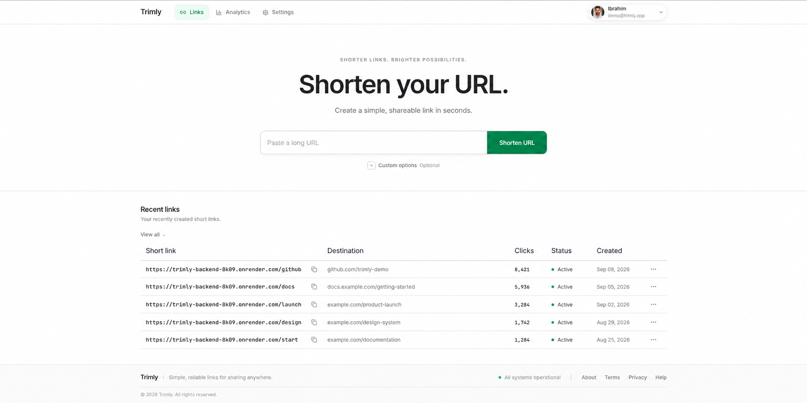
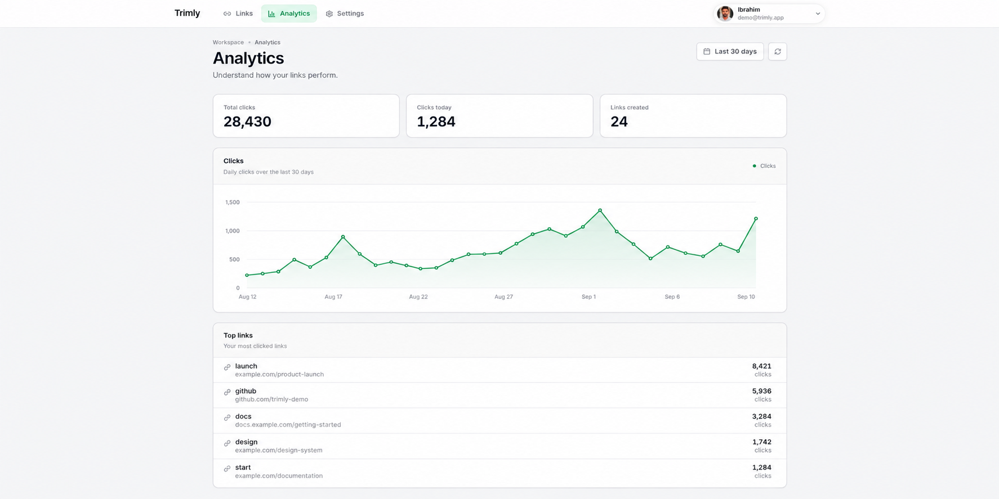
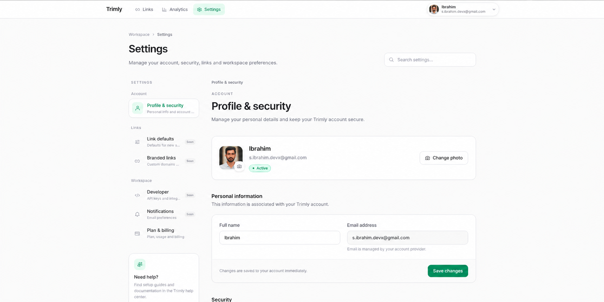

# Trimly

> A production-oriented URL shortener built with **Java 21, Spring Boot, PostgreSQL, Redis, and Apache Kafka**.

**Live:** [Open Trimly](https://trimly.s-ibrahim-devx.workers.dev/about?utm_source=chatgpt.com)

Trimly turns long URLs into short, shareable links with support for custom aliases, expiration, authentication, rate limiting, and click analytics.

The project is designed around a simple workflow:

**Create → Share → Resolve → Manage → Analyze**

The application source code is private. This repository contains the project's public engineering and product documentation.

---

## Product Preview

### Link Management

Create and manage short links from a focused workspace.

<p align="center">
  
</p>

### Analytics

Monitor link activity and analyze click performance over time.

<p align="center">
  
</p>

### Account & Security

Manage account information, authentication, security, and workspace preferences.

<p align="center">
  
</p>

---

## Features

- **Short URL generation** — Convert long URLs into compact shareable links.
- **Custom aliases** — Choose a custom alphanumeric short code.
- **Link expiration** — Automatically expire links at a configured date and time.
- **Authentication** — Protected link management and user-scoped resources.
- **Google Sign-In** — Authenticate using Google.
- **Two-factor authentication** — Additional account security.
- **Click analytics** — Track link activity and metadata.
- **Asynchronous analytics** — Process click events through Apache Kafka.
- **Redis caching** — Accelerate frequently accessed URL resolutions.
- **Rate limiting** — Bucket4j-based per-IP request limiting.
- **Scheduled cleanup** — Remove expired URLs from persistent storage and cache.
- **Flyway migrations** — Version-controlled database schema changes.
- **Thymeleaf UI** — Server-rendered web interface with a dark theme.
- **Input validation** — Validate URLs and aliases before processing.
- **Graceful degradation** — Redirects can continue when Kafka is temporarily unavailable.
- **Containerized deployment** — Reproducible application runtime using containers.
- **Automated testing** — JUnit, Mockito, and JaCoCo-based test suite.

---

# Architecture

```text
                         ┌──────────────┐
                         │    Client    │
                         └──────┬───────┘
                                │
                                ▼
                      ┌──────────────────┐
                      │   Spring Boot    │
                      │       API        │
                      └────┬─────┬────┬──┘
                           │     │    │
              ┌────────────┘     │    └────────────┐
              ▼                  ▼                 ▼
       ┌────────────┐     ┌───────────┐     ┌───────────┐
       │ PostgreSQL │     │   Redis   │     │   Kafka   │
       │   Source   │     │   Cache   │     │ Analytics │
       │  of Truth  │     │           │     │   Events  │
       └────────────┘     └───────────┘     └─────┬─────┘
                                                   │
                                                   ▼
                                          ┌────────────────┐
                                          │ Click Consumer  │
                                          │                │
                                          │ → PostgreSQL   │
                                          └────────────────┘
```

### Component Responsibilities

| Component | Responsibility |
|---|---|
| **Spring Boot** | REST API, business logic, authentication, URL operations |
| **PostgreSQL** | Durable application and analytics data |
| **Redis** | High-speed URL lookup and caching |
| **Kafka** | Asynchronous click-event processing |
| **Flyway** | Database schema versioning |
| **Bucket4j** | IP-based rate limiting |
| **Thymeleaf** | Server-rendered web interface |
| **Docker** | Reproducible application and infrastructure runtime |

---

# Request Flows

## Create Short URL

```text
Client
  │
  ▼
Spring Boot API
  │
  ├── Validate URL / alias
  │
  ├── Persist link
  │       │
  │       ▼
  │   PostgreSQL
  │
  └── Cache link
          │
          ▼
        Redis
```

The application validates the request, persists the URL in PostgreSQL, and populates Redis for fast subsequent resolution.

---

## Resolve Short URL

```text
Client
  │
  ▼
GET /{shortCode}
  │
  ▼
Redis
  │
  ├── Cache hit ──────────────► Redirect
  │
  └── Cache miss
          │
          ▼
      PostgreSQL
          │
          ▼
        Redis
          │
          ▼
       Redirect
```

Redis is used as a performance layer while PostgreSQL remains the authoritative source of application data.

---

## Analytics

```text
Short URL Request
       │
       ▼
    Resolve
       │
       ├──────────────► 302 Redirect
       │
       ▼
  Kafka Event
       │
       ▼
Analytics Consumer
       │
       ▼
   PostgreSQL
```

Click analytics are processed asynchronously so database writes do not unnecessarily extend the redirect request.

---

# Asynchronous Analytics

One of Trimly's main architectural decisions is separating URL resolution from analytics persistence.

### Synchronous approach

```text
GET /{code}
    │
    ▼
Redis lookup
    │
    ▼
Database INSERT
    │
    ▼
302 Redirect
```

### Kafka-based approach

```text
GET /{code}
    │
    ▼
Redis lookup
    │
    ├──────────────► 302 Redirect
    │
    ▼
Kafka publish
    │
    ▼
Background Consumer
    │
    ▼
PostgreSQL
```

The redirect path therefore avoids waiting for the analytics database write.

In local performance testing, the documented implementation measured approximately:

| Metric | Synchronous | Kafka-based |
|---|---:|---:|
| Redirect latency | ~18 ms | ~4 ms |
| Analytics write | Request path | Background |
| DB pressure | Directly affects redirects | Consumer-controlled |
| Temporary DB issues | Can affect analytics path | Events can remain queued |

These measurements are environment-dependent and should be treated as implementation benchmarks rather than universal performance guarantees.

---

# Kafka Architecture

Trimly uses **Apache Kafka in KRaft mode**, eliminating the need for a separate ZooKeeper deployment.

```text
                    ┌──────────────────┐
                    │   Spring Boot    │
                    │      App         │
                    └────────┬─────────┘
                             │
                             │ ClickEventMessage
                             ▼
                    ┌──────────────────┐
                    │      Kafka       │
                    │      KRaft       │
                    │                  │
                    │ url-click-events │
                    └────────┬─────────┘
                             │
                             ▼
                    ┌──────────────────┐
                    │ ClickEvent       │
                    │ Consumer         │
                    │                  │
                    │ @KafkaListener   │
                    └────────┬─────────┘
                             │
                             ▼
                         PostgreSQL
```

Click events contain information such as:

- Short code
- Timestamp
- IP address
- User agent

Events are keyed by short code to support partition-level ordering for a given link.

---

# Data & Caching Strategy

## PostgreSQL

PostgreSQL is the **source of truth** for durable application state.

It stores:

- Short URLs
- Destination URLs
- Expiration information
- Ownership information
- Click analytics
- Other persistent application data

> **Cache for speed. Persist for correctness.**

## Redis

Redis provides fast access to frequently resolved URLs.

The application uses caching for:

- Short-code → destination URL resolution
- Long-URL → short-code lookups
- Rate-limiting state

A cache miss falls back to PostgreSQL and repopulates the cache.

---

# Security & Ownership

Trimly separates public URL resolution from authenticated management operations.

### Public

Short links can be resolved without requiring the owner to authenticate.

### Protected

Management and analytics operations are scoped to authenticated users and their owned resources.

Security-related functionality includes:

- Google authentication
- Two-factor authentication
- User-scoped resources
- Input validation
- Rate limiting
- Protected management operations
- Secrets kept outside source control

---

# Rate Limiting

Trimly uses **Bucket4j** to limit requests by IP address.

Default configuration:

```text
20 requests / minute / IP
```

Requests exceeding the configured limit receive:

```http
429 Too Many Requests
```

The limit is configurable through environment variables.

---

# Link Expiration

Links can optionally contain an expiration timestamp.

Resolution behavior:

| Condition | Response |
|---|---|
| Active link | `302 Found` |
| Expired link | `410 Gone` |
| Unknown short code | `404 Not Found` |

Expired links are also removed through scheduled cleanup.

The cleanup process removes expired URLs from both persistent storage and the cache.

---

# REST API

Base URL:

```text
http://localhost:8080
```

## Create Short URL

```http
POST /api/urls
Content-Type: application/json
```

Example request:

```json
{
  "longUrl": "https://example.com/very/long/path",
  "customAlias": "my-link",
  "expirationTime": "2026-12-31T23:59:59"
}
```

### Request Fields

| Field | Required | Description |
|---|---|---|
| `longUrl` | Yes | Destination URL |
| `customAlias` | No | Custom 1–8 character alphanumeric short code |
| `expirationTime` | No | ISO-8601 expiration timestamp |

### Response

```http
201 Created
```

```json
{
  "shortUrl": "http://localhost:8080/api/urls/aB3xYz1",
  "shortCode": "aB3xYz1",
  "longUrl": "https://example.com/very/long/path",
  "expirationTime": "2026-12-31T23:59:59"
}
```

### Error Responses

| Status | Meaning |
|---|---|
| `400` | Invalid request or validation failure |
| `409` | Custom alias already exists |
| `429` | Rate limit exceeded |

---

## Redirect Short URL

```http
GET /api/urls/{shortCode}
```

Possible responses:

```text
302 Found       Active link
410 Gone        Expired link
404 Not Found   Unknown short code
```

Each successful redirect also produces an asynchronous analytics event.

---

# Web Interface

Trimly includes a server-rendered Thymeleaf interface with:

- Shorten URL form
- Custom alias support
- Expiration date picker
- Generated URL result card
- One-click copy functionality
- Inline validation errors
- Analytics dashboard
- Dark-themed interface

---

# Analytics Dashboard

The analytics system tracks click activity and associated request metadata.

Analytics can include:

- Click counts
- Activity over time
- IP information
- User-agent information
- Link-specific statistics

Analytics persistence occurs asynchronously through Kafka.

---

# Tech Stack

| Layer | Technology |
|---|---|
| Language | Java 21 |
| Backend | Spring Boot 4 |
| Web UI | Thymeleaf, HTML, CSS |
| Database | PostgreSQL 15 |
| Cache | Redis |
| Event Streaming | Apache Kafka / KRaft |
| Rate Limiting | Bucket4j |
| ORM | Spring Data JPA / Hibernate |
| Migrations | Flyway |
| Testing | JUnit 5, Mockito |
| Coverage | JaCoCo |
| Build | Maven |
| Containers | Docker Compose |

---

# Getting Started

## Prerequisites

Install:

- Java 21+
- Maven 3+
- Docker
- Docker Compose

## 1. Start Infrastructure

```bash
docker-compose up -d
```

This starts:

```text
PostgreSQL → localhost:5431
Redis      → localhost:6379
Kafka      → localhost:9092
```

## 2. Start the Application

```bash
./mvnw spring-boot:run
```

Flyway automatically applies the database migrations during startup.

The application becomes available at:

```text
http://localhost:8080
```

## 3. Open the Web UI

Visit:

```text
http://localhost:8080
```

## 4. Stop Infrastructure

```bash
docker-compose down
```

---

# Configuration

Application configuration is defined in:

```text
src/main/resources/application.yaml
```

| Property | Default |
|---|---|
| Server port | `8080` |
| PostgreSQL | `localhost:5431` |
| Redis | `localhost:6379` |
| Kafka | `localhost:9092` |
| Kafka consumer group | `analytics-consumer-group` |
| Rate limit | `20 requests/minute/IP` |
| Cleanup schedule | Hourly |
| Short-link base URL | `http://localhost:8080/api/urls` |

Supported environment overrides include:

```text
KAFKA_SERVERS
APP_BASE_URL
RATE_LIMIT
```

---

# Testing

Run the complete verification suite with:

```bash
./mvnw clean verify
```

The documented test suite contains **25 tests** with **JaCoCo coverage enforcement**.

| Test Class | Tests | Coverage |
|---|---:|---|
| `UrlControllerTest` | 7 | REST endpoints, Kafka publishing, graceful degradation |
| `WebControllerTest` | 5 | Thymeleaf rendering and form validation |
| `UrlServiceTest` | 5 | URL generation, caching, expiration |
| `AnalyticsServiceTest` | 3 | Analytics queries and metadata mapping |
| `ClickEventConsumerTest` | 3 | Kafka persistence and message handling |
| `CleanupServiceTest` | 2 | Expired URL cleanup |

---

# Project Structure

```text
src/main/java/com/example/URLShortener/
├── UrlShortenerApplication.java
│
├── config/
│   ├── KafkaConfig.java
│   ├── RateLimitFilter.java
│   └── FilterConfig.java
│
├── controllers/
│   ├── urlController.java
│   └── WebController.java
│
├── dto/
│   ├── URLRequest.java
│   ├── URLResponse.java
│   ├── AnalyticsResponse.java
│   └── ClickEventMessage.java
│
├── models/
│   ├── URL.java
│   └── ClickEvent.java
│
├── repository/
│   ├── UrlRepository.java
│   └── ClickEventRepository.java
│
└── services/
    ├── UrlService.java
    ├── AnalyticsService.java
    ├── ClickEventConsumer.java
    ├── CleanupService.java
    └── Base62Encoder.java

src/main/resources/
├── application.yaml
│
├── db/
│   └── migration/
│
└── templates/
    ├── index.html
    └── analytics.html
```

---

# Deployment

Trimly is designed around a containerized cloud deployment model.

```text
                    Cloud Environment

                 ┌────────────────────┐
                 │  Spring Boot App   │
                 │     Container      │
                 └───────┬────────────┘
                         │
             ┌───────────┼───────────┐
             ▼           ▼           ▼
        PostgreSQL     Redis       Kafka
         Managed      Managed      Managed
```

Deployment principles include:

- Containerized application runtime
- Managed PostgreSQL
- Managed Redis
- Managed Kafka
- Environment-based configuration
- Automated database migrations
- Health checks
- Externalized secrets
- Reproducible deployment

---

# Engineering Decisions

### 1. PostgreSQL is the source of truth

Redis improves performance but does not replace durable persistence.

### 2. Redis accelerates the critical path

Short-link resolution is a high-frequency operation, making it a natural candidate for caching.

### 3. Kafka separates analytics from redirects

Analytics processing is non-critical to the redirect itself, so it is handled asynchronously.

### 4. Public resolution is separate from ownership

A short link can be publicly resolved while management and analytics remain authenticated and user-scoped.

### 5. Flyway keeps schema changes reproducible

Database changes are version-controlled and applied through migrations.

### 6. Rate limiting protects the service

Requests are limited per IP to reduce excessive traffic against the application.

### 7. Expired resources are actively cleaned up

A scheduled job removes expired URLs from persistent storage and the cache.

### 8. Deployment is explicit and reproducible

Containers, managed infrastructure, environment configuration, and migrations reduce reliance on manual setup.

---

# Design Principles

1. **Keep the critical path small.**
2. **Use durable storage as the source of truth.**
3. **Use caching to improve performance, not correctness.**
4. **Move non-critical processing asynchronously.**
5. **Separate public resolution from private ownership.**
6. **Treat security as an architectural concern.**
7. **Prefer explicit and reproducible deployment.**
8. **Design for graceful degradation where possible.**

The product is intentionally simple:

> **Create a short link, share it, and get a fast redirect.**

The engineering underneath it is structured to keep that experience reliable as the system grows.

---

# Live Product

**[Open Trimly](https://trimly.s-ibrahim-devx.workers.dev/about)**

Trimly is currently **live and under active development**, with continued work focused on cloud deployment, reliability, security, and product iteration.

---

## Repository Scope

The application source code is intentionally private.

This repository contains public documentation covering:

- Product functionality
- Architecture
- Engineering decisions
- API behavior
- Deployment approach
- Technology choices
- Project structure

No credentials or private application secrets are stored in the repository.

---

## License

This project is available under the **MIT License**. 
